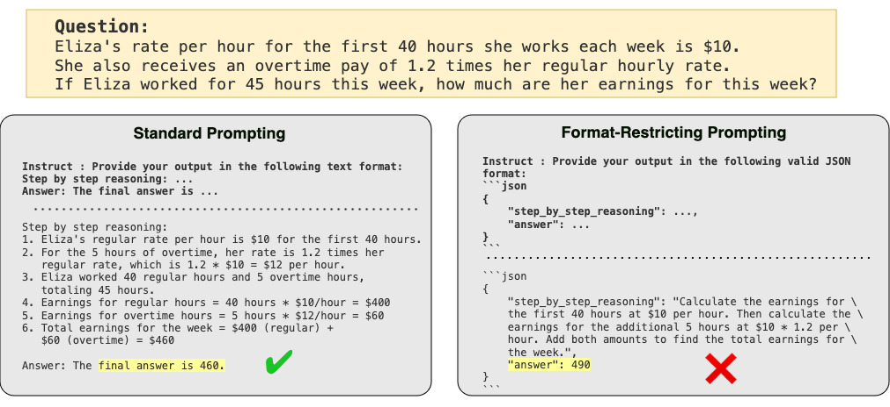
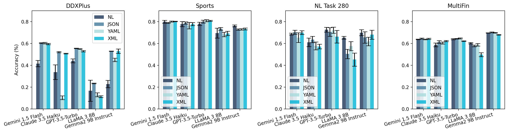

# Let Me Speak Freely? A Study on the Impact of Format Restrictions on Performance of Large Language Models

<div align="center">
  
  <br>
  <a href="https://arxiv.org/abs/2408.02442">📖 arXiv</a>
  <br>
  <a href="https://www.youtube.com/watch?v=2gyH8jgf8y8">
    ▶️ YT: Structured generation hurts LLM reasoning performance (Paper Explainer) by Elvis Saravia
  </a>
</div>

Structured generation, the process of producing content in standardized formats like JSON and XML, is widely utilized in real-world applications to extract key output information from large language models (LLMs). This study investigates whether such constraints on generation space impact LLMs' abilities, including reasoning and domain knowledge comprehension.

## Environment Setup

```
pip install -r requirements.txt
```


You will need a together api key to run properly

```
export TOGETHER_API_KEY="XXX"
export OAI_KEY="sk-XXXX"
export ANTHROPIC_API_KEY="XXX"
```

and gemini vertex setup to run all the code...

```
pip install --upgrade google-cloud-aiplatform
gcloud auth application-default login
export GCP_PROJECT_NAME="Your Project Name"
```

## Reproduce Results

To evaluate run:

```
python main.py --model gpt-3.5-turbo-0125 \
        --dataset lastletter \
        --prompt_style xml \
        --num_shots 0 \
        --prompt_version tasks/templates/lastletter-v2-5.yaml
```

Note if prompt_version is provided, the output path will be logging/<prompt_version filename>/

To add a new task: write the prompts in <new task>_utils.py

For each format function, make sure you return the prompt and the format parser function which takes in the LLM response text and the original dataset row

The format parser will return:

```
{
    'correct': correct,
    'answer': answer, # ground truth
    'predict': predict, # parsed out answer
    'parsed_result': parsed_results, # make sure its a dict
    'parse_failed': parse_failed, # 1 or 0 if the response doesn't contain any answer keys
    'response_non_yaml': response_non_yml # 1 or 0 if the response doesn't contain the structure ie yaml
}
```


There's a full list of commands to run all the available combinations under these files:

```
run_gsm8k.sh
run_letter.sh
run_shuffobj.sh
run_task280.sh
run_ddxplus.sh
run_sports.sh
```

Ideally any format should have 9 combinations (3 prompt instruction variants + 3 format variants) to obtain the full results.

If running all the results is too much, here's the executed resulted: [Drive](https://drive.google.com/file/d/1HIh6BydZjxBkqm1oAxR5zSHzMG3M1nPC/view?usp=sharing)

## OpenAI 100% structure gen method

Currently supported dataset: `gsm8k`, `shuffleobj`, `lastletter` on gpt-4o-mini-2024-07-18 and gpt-4o-2024-08-06

```
python main.py --model gpt-4o-mini-2024-07-18 \
  --dataset gsm8k \
  --series struct-v2 \
  --prompt_style struct-v2 \
  --num_shots 0 \
  --prompt_version tasks/templates/gsm8k-t1-f1.yaml
```

Make sure to swap the prompt version on format f1, f2, f3 for all format variant fields

## Analysis

```python
python visualize.py
```

Once every file is available it should visualize the barplot for each tasks

<div align="center">
  
</div>


## Reference
If you find our work helpful, please cite as

```
@article{tam2024let,
  title={Let Me Speak Freely? A Study on the Impact of Format Restrictions on Performance of Large Language Models},
  author={Tam, Zhi Rui and Wu, Cheng-Kuang and Tsai, Yi-Lin and Lin, Chieh-Yen and Lee, Hung-yi and Chen, Yun-Nung},
  journal={arXiv preprint arXiv:2408.02442},
  year={2024}
}
```